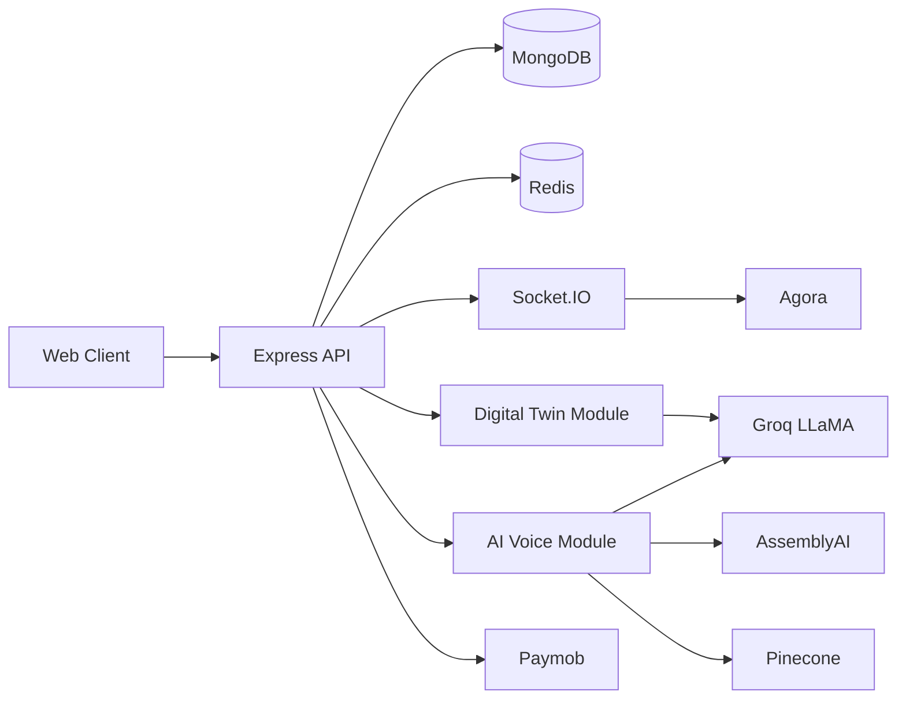

# Neura — Real Time Digital Twin Integrated Healthcare Monitoring System

<p>
  <strong>Healthcare platform for patient monitoring, telemedicine, clinical documentation, and Digital Twin based health analysis.</strong>
</p>

<p>
  
  
  
  
  
  
  
  
  
  
</p>


## Project Overview

Neura is a multi role healthcare platform designed to support patients and healthcare providers through real time communication, medical record management, AI powered clinical assistance, and Digital Twin modeling.

The system provides role based access for patients, doctors, nurses, pharmacies, and administrators. It integrates AI services for Arabic speech transcription, clinical summarization, semantic search, and health state analysis while maintaining a realtime communication layer powered by Socket.IO.

<<<<<<< HEAD
<<<<<<< HEAD

## API Documentation

The backend exposes **45 REST APIs** organized across **26 Postman folders**, covering authentication, appointments, medical records, Digital Twin operations, AI voice processing, payments, notifications, and real-time communication.

### API Statistics

| Metric | Value |
|---------|---------|
| REST APIs | 45 |
| Total Requests | 99 |
| Socket Namespaces | 4 |
| User Roles | 5 |

### Resources

- Postman Collection: [Open Collection](https://documenter.getpostman.com/view/39421274/2sBXVbGDcW)
- Base URL: `https://real-time-digital-twin-integrated.onrender.com/api/v1`

### API Coverage

- Authentication & Authorization
- Patients Management
- Doctors Management
<<<<<<< HEAD
- Appointments
- Medical Records
- Digital Twin
- AI Voice Processing
- Chat System
- Notifications
- Payments
=======
<!-- <p align="center">
  
  
  
  
</p> -->
=======
>>>>>>> 6140f1d (Update README with API statistics and cleanup)

## API Documentation

The backend exposes **45 REST APIs** organized across **26 Postman folders**, covering authentication, appointments, medical records, Digital Twin operations, AI voice processing, payments, notifications, and real-time communication.

<<<<<<< HEAD
| Metric            | Value                                 |
| ----------------- | ------------------------------------- |
| REST APIs         | 45                                    |
| Total Requests    | 99                                    |
| Socket Namespaces | 4                                     |
| User Roles        | 5                                     |
>>>>>>> 186d36b (Add README.md for Neura healthcare platform)
=======
### API Statistics

| Metric | Value |
|---------|---------|
| REST APIs | 45 |
| Total Requests | 99 |
| Socket Namespaces | 4 |
| User Roles | 5 |

### Resources

- Postman Collection: [Open Collection](https://documenter.getpostman.com/view/39421274/2sBXVbGDcW)
- Base URL: `https://real-time-digital-twin-integrated.onrender.com/api/v1`

### API Coverage

- Authentication & Authorization
- Patients Management
- Doctors Management
- Nurses Management
- Pharmacies Management
=======
>>>>>>> 03f59aa (Remove Nurses, Pharmacies, and Prescriptions sections)
- Appointments
- Medical Records
- Digital Twin
- AI Voice Processing
- Chat System
- Notifications
- Payments
>>>>>>> 6140f1d (Update README with API statistics and cleanup)


## System Architecture


---
## Key Features

### Digital Twin

* Patient health state modeling
* Health risk estimation
* Continuous updates from medical records
* What-if scenario simulation

### AI Voice Processing

* Arabic speech to text transcription
* Clinical note generation
* Medical consultation summarization
* Vector based semantic retrieval

### Real Time Communication

* Doctor patient chat
* Presence tracking
* Notification delivery
* WebRTC therapy rooms

### Authentication & Security

* JWT Authentication
* Google OAuth
* Email verification
* Role based authorization

### Payment Management

* Paymob integration
* Payment verification
* Webhook processing
* Refund support

### Performance & Reliability

* Redis caching
* Background jobs
* Structured logging
* Graceful shutdown handling

---

## Socket.IO Namespaces

| Namespace        | Purpose                  |
| ---------------- | ------------------------ |
| `/`              | Presence Tracking        |
| `/chat`          | Doctor-Patient Messaging |
| `/notifications` | Notification Delivery    |
| `/rooms`         | Therapy Sessions         |

---

## Project Structure

```text
src
├── config
├── core
├── cache
├── routes
├── modules
│   ├── auth
│   ├── patients
│   ├── doctors
│   ├── nurses
│   ├── pharmacies
│   ├── appointments
│   ├── medical-records
│   ├── prescriptions
│   ├── digital-twin
│   ├── ai-voice
│   ├── chat
│   ├── notifications
│   ├── therapy-rooms
│   ├── payments
│   └── admin
├── socket
├── jobs
├── templates
└── shared
```

---

## Tech Stack

| Category            | Technology             |
| ------------------- | ---------------------- |
| Runtime             | Node.js 22.x           |
| Framework           | Express 5.x            |
| Database            | MongoDB + Mongoose     |
| Cache               | Redis                  |
| Real Time           | Socket.IO              |
| LLM                 | GROQ LLaMA 3.3-70B     |
| Speech-to-Text      | AssemblyAI Universal-2 |
| Vector Database     | Pinecone               |
| Payments            | Paymob                 |
| Video Communication | Agora WebRTC           |
| Media Storage       | Cloudinary             |


---

## Getting Started

### Prerequisites

- **Node.js** >= 22.x
- **MongoDB** >= 6.x (Atlas or local)
- **Redis** >= 7.x (or Redis Cloud instance)
- **Accounts**: [GROQ](https://console.groq.com), [AssemblyAI](https://www.assemblyai.com), [Pinecone](https://www.pinecone.io), [Cloudinary](https://cloudinary.com), [Paymob](https://paymob.com), [Agora](https://www.agora.io), [Resend](https://resend.com)

### Installation

```bash
git clone https://github.com/Ashraf8amir/Neura-Reactive-System.git

cd neura

npm install

cp .env.example .env

npm run dev
```

Set the following environment variables in `.env`:

| Variable | Description |
|---|---|
| `PORT` | Server port (default: 3070) |
| `MONGO_URL` | MongoDB connection string |
| `REDIS_URL` | Redis connection string |
| `JWT_SECRET` | 64-byte hex secret for token signing |
| `OPENROUTER_API_KEY` | Alternative LLM provider key |
| `GROQ_API_KEY` | GROQ API key for LLaMA inference |
| `ASSEMBLYAI_API_KEY` | Speech-to-text API key |
| `PINECONE_API_KEY` | Vector database API key |
| `PINECONE_INDEX` | Pinecone index name (`neura-system`) |
| `CLOUDINARY_*` | Cloudinary credentials (name, key, secret) |
| `PAYMOB_API_KEY` | Paymob payment gateway key |
| `AGORA_APP_ID` | Agora video SDK app ID |
| `RESEND_API_KEY` | Email delivery API key |
| `FRONTEND_URL` | CORS origin (e.g., `http://localhost:5173`) |

---

## License

Distributed under the ISC License. See `package.json` for details.
